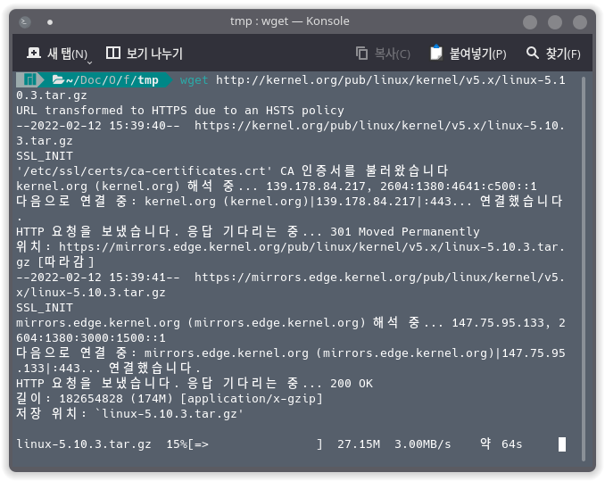
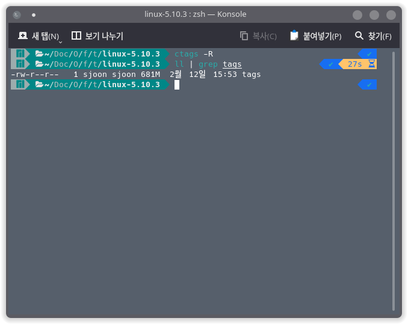
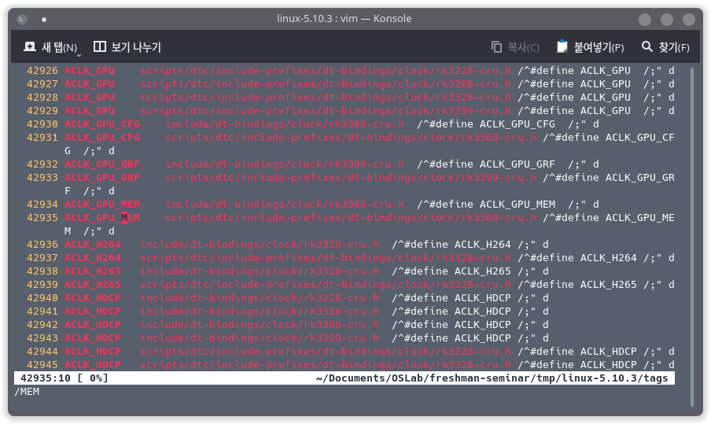
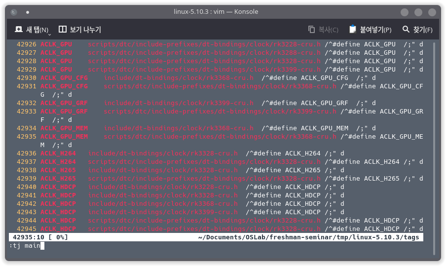
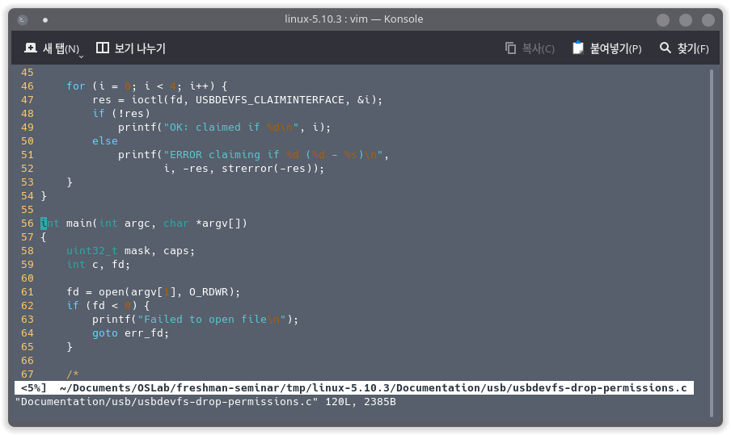
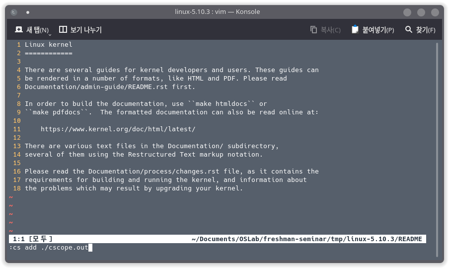

# ctags와 cscope

## ctags

ctags란 다양한 프로그래밍 언어 코드 파일의 인덱스(또는 tag)를 생성하는 유틸리티입니다. Visual Studio Code나 이클립스와 같은 GUI 기반 에디터는 기본적으로 함수 또는 변수, 구조체나 그 필드, 매크로 등의 정의와 선언부를 쉽게 이동하는 기능을 제공합니다. `CTRL` 버튼과 마우스 클릭 하나면 쉽게 이동이 가능합니다. 이와 비슷하게, ctags는 다양한 에디터에서도 쉽게 코드 분석이 가능하도록 일종의 데이터베이스 파일을 생성합니다. ctags를 지원하는 에디터는 Vim, KDE의 Kate, KDevelop, Emacs 등 [다양한 종류](https://en.wikipedia.org/wiki/Ctags#Editors_that_support_ctags)가 존재합니다. 

<!--more-->

개인 데스크탑 환경에서는 리눅스에서도 훌륭한 에디터들이 존재하지만, 서버를 다루거나 GUI 환경이 아닌 곳에서는 코드 분석이 어렵기 때문에 ctags와 같은 유틸리티를 이용합니다.


### ctags 설치

ctags 설치는 아래와 같이 진행합니다.

```zsh
$ sudo apt-get install ctags # Debian-based Distributions
$ brew install ctags # Mac
$ sudo pacman -Syu ctags # Arch-based Distributions
```

### tags 파일 생성

함수의 정의나 선언부로 이동하고 싶다면 위치가 어디에 있는지를 알고 있어야 합니다. 위치를 모르는데 길을 찾아갈 수는 없으니까요. 따라서 우선 `tags` 파일을 생성해 주어야 합니다. 

 \* 여기서는 예제로 리눅스 커널 v5.10.3으로 진행해 보겠습니다. 환경은 Manjaro 21.2.0 Qonos로 진행하였습니다.

 

 ```zsch
$ wget http://kernel.org/pub/linux/kernel/v5.x/linux-
5.10.3.tar.gz
$ tar -xvf linux-5.10.3.tar.gz && cd linux-5.10.3
 ```

커널 디렉토리에서 다음과 같은 방법으로 ctags 파일을 생성할 수 있습니다. 직접 파일을 지정하거나, 현재 위치에서 하위 디렉토리까지 모두 지정하고 싶다면 `-R`(Recursive) 옵션을 사용합니다.

```zsh
$ ctags [File 1] [File 2] ... # Specify files
$ ctags -R
```

그러면 아래와 같이 `tags` 파일이 생성된 것을 확인할 수 있습니다.



`tags` 파일 형식은 아래와 같습니다. 순서대로 태그 이름, 정의된 파일, 파일내 정의 형식으로 구분됩니다.



### ctags의 기본 사용법

우선 ctags 기본 사용법을 정리하고 정리하고 가겠습니다. 앞서 생성했던 `tags` 파일을 열고, 명령행 모드에서 아래와 같이 사용합니다.

```zsh
: tj [tag_name] # Tag Jump!
```

예를 들어보겠습니다. 현재 디렉토리에 있는 코드 중에서 `main` 함수를 찾고 싶다면, `tj main` 을 명령행 모드에서 사용하고, 



소스에서 원하는 정의를 선택합니다. 여기에서는 3번 `usbdevfs-drop-permissions.c` 파일의 `main` 을 찾아가겠습니다.




그러면 함수의 정의로 이동하는 것을 확인할 수 있습니다.


### tag 파일의 경로 등록

ctags를 이용하기 위해서는 `tags` 파일이 존재하는 최상위 디렉토리에서 에디터를 실행시켜야 합니다. 이는 번거롭기 때문에 `tags` 파일이 존재하는 경로를 미리 지정할 수 있습니다. Vim 에디터를 사용하고 있다면 설정 파일 `~/.vimrc` 파일에 다음과 같이 작성하고 현재 세션에 적용합니다.

예를 들어, 

```zsh
set tags=/home/sjoon/Documents/OSLab/freshman-seminar/tmp/linux-5.10.3/tags
```

와 같이 변수를 추가한 후 `$ source ~/.vimrc` 로 적용합니다.

그러나, `~/.vimrc` 파일에는 일반적으로 자주 사용하는 세팅값들이 미리 들어있습니다. 이를 따로 수정하는 것은 별로 좋아하지 않을 뿐더러, 분석해야 하는 코드의 경로가 매번 바뀐다면 설정 파일 또한 매번 수정해 주어야 합니다. 또는, 

```zsh
set tags=/some_dir,./some_other_dir,./some_dir/some_subdir
```

와 같이 여러개 추가해주어야 합니다. 따라서 저는 보통 열어둔 Vim 세션에 바로 경로를 추가하는 것을 더 선호합니다. 위의 `set tags=` 를 Vim 의 명령행 모드에서 직접 추가하는 것도 가능합니다.


### ctags 기본 명령어

자주 사용되는 명령어는 다음과 같습니다.

| Keywords | Description |
|---|---|
| `ta [TAG]` / `CTRL + ]` | `TAG`가 정의된 위치로 이동 |
| `tj [TAG]` / `ts [TAG]` | `TAG`가 정의된 위치를 나열하고 사용자가 선택하여 이동 |
| `sta [TAG]` | 창을 수평분할하여 커서를 새로운 창에 위치 |
| `stj [TAG]` | 창을 수평분할하여 커서를 새로운 창에 위치 |
| `po` / `CTRL + t` | 이전에 있던 위치로 돌아가기 |
| `tn` | Next, 다음 TAG 리스트로 이동 |
| `tp` | Previous, 이전 TAG 리스트로 이동 |
| `tr` / `tf`| Rewind/First, 리스트의 제일 처음으로 이동 |
| `tl` | Last, 리스트의 마지막 항목으로 이동 |


## cscope

cscope는 ctags와 마찬가지로 소스 코드 분석을 용이하게 하는 도구입니다. Vim, Kate와 같은 CLI/GUI 에디터와 같이 사용 가능합니다. ctags와 마찬가지로, 우선 데이터베이스 파일을 생성한 후, Vim의 명령행 창으로 사용이 가능합니다.


### cscope 설치

cscope 설치는 아래와 같이 진행합니다.

```zsh
$ sudo apt install cscope # Debian-based Distributions
$ brew install cscope # Mac
$ sudo pacman -Syu cscope # Arch-based Distributions
```


### 데이터베이스 파일 생성

ctags와 마찬가지로 cscope 또한 데이터베이스 파일을 필요로합니다. 생성 방법은 디렉토리 최상단에서 아래와 같이 사용합니다.

```zsh
$ find ./ -name "*.[chS]" > cscope.files
$ cscope -i cscope.files
```

일단 `.c`, `.h`, `.S` 확장자를 가지고 있는 파일을 찾은 후 리스트를 `cscope.files` 라는 이름의 파일에 저장합니다. 그리고 이 파일을 `-i` 옵션으로 지정하여 데이터베이스 파일을 생성합니다. 생성되는 파일의 이름은 `cscope.out` 입니다.

이후 `CTRL + D` 로 빠져나갑니다.


그러면 `cscope.out` 파일이 생성된 것을 확인할 수 있습니다.


### cscope의 기본 사용법

`cscope.out`이 생성된 디렉토리에서 Vim을 실행시킵니다. 그리고 `cscope.out` 파일의 경로를 에디터에 추가합니다.

```zsh
: cscope add [cscope_file_path]
```

또는 `cscope` 명령어는 `cs`로 축약이 가능하므로

```zsh
: cs add [cscope_file_path]
```

와 같이 추가합니다. 최상단 디렉토리의 `README` 파일에서 경로를 추가해보겠습니다.



ctags와 마찬가지로, `~/.vimrc`에 경로를 지정할 수 있습니다. 그러면 파일이 자동적으로 로딩됩니다.

```zsh
if filereadable("./cscope.out")
    cs add cscope.out
endif
```

### cscope 명령어

cscope는 기본적으로 ctags를 사용했던 것 처럼 Vim 명령행 모드에서 사용하면 됩니다. 이때 형식은,

```zsh
: cscope find [QueryType] [Symbol]
```

또는 축약형으로 아래와 같이 사용도 가능합니다.

```zsh
: cs f [QueryType] [Symbol]
```

| QueryType | Description |
|---|---|
| `s` / `0` | Symbol, C 심볼 검색 |
| `g` / `1` | Global Definitions, 선언(정의)부 탐색  |
| `d` / `2` | 이 함수가 호출 하는 함수 목록 출력 |
| `c` / `3` | Call, 이 함수를 호출하는 함수 출력 |
| `t` / `4` | 문자열 검색 |
| `e` / `5` | egrep, 확장 정규식을 사용하여 검색 |
| `f` / `7` | File, 파일 검색 (파일 이름 검색) |
| `i` / `8` | Include, 이 파일을 포함하는 파일을 검색 |
