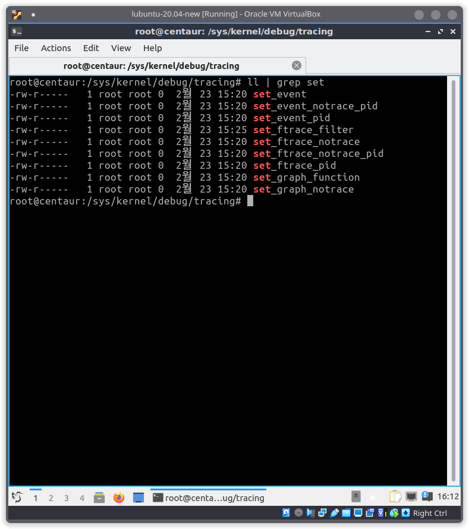
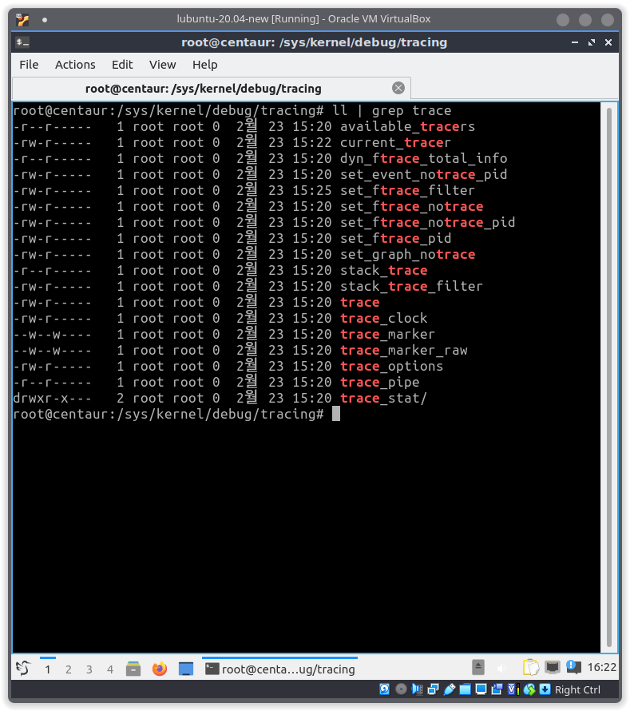
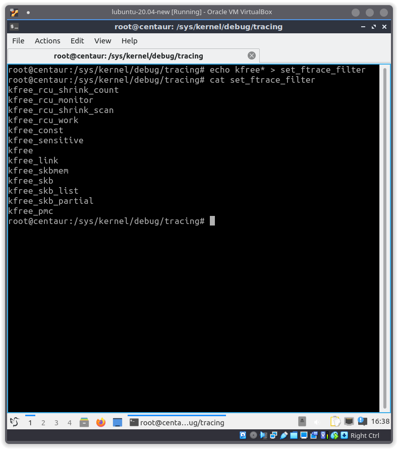

# Essential Tools 3: ftrace

> 신입생 세미나 5: Benchmark & Analysis (Cont'd)
> 
Author: 2022.02. 오석준

## ftrace

ftrace는 커널 내부(outside of user-space)에서 무슨 일이 일어나고 있는지 관찰할 수 있도록 하는 툴입니다. 일반적으로 function tracing에 많이 사용하지만 사실은 다른 tracing 유틸리티도 포함하고 있습니다. 이는 위의 공식 문서 링크에서 확인할 수 있습니다. 여기서는 일반적인 function tracer, 또는 event tracer 으로써 초간단 사용법에 대한 내용만 다루겠습니다.

<!--more-->


### Test Environment (테스트 환경)

테스트 환경은 아래와 같습니다. 이전 포스트의 환경에, 5.16 커널을 사용합니다.

- [Manjaro Linux]() 21.2 Qonos
- Intel Core i7-10700 CPU @ 2.90GHz
- RAM 31.2 GiB
- VM: Lubuntu 20.04 LTS

참고 자료: [https://www.kernel.org/doc/html/latest/trace/ftrace.html](https://www.kernel.org/doc/html/latest/trace/ftrace.html)

```
$ uname -srvio
Linux 5.16.5-1-MANJARO #1 SMP PREEMPT Tue Feb 1 16:57:14 UTC 2022 unknown GNU/Linux
```


## 관련 파일

```sh
$ cd /sys/kernel/debug/tracing
```

ftrace는 이 디렉토리에 존재하는 파일을 제어하면서 사용합니다. 주로 사용되는 주요 파일 몇 가지만 정리해 보면 아래와 같습니다.

### set_*



| File | Description |
|------|-------------|
| `set_ftrace_filter` | trace 할 함수를 작성합니다. 기본적으로는 모든 함수로 활성화 되어 있습니다. |
| `set_ftrace_notrace` | `set_ftrace_filter`의 반대 역할을 수행합니다. trace 하지 않을 함수를 작성합니다. |
| `set_ftrace_pid` | 지정된 PID를 가진 쓰레드만 trace 합니다. |
| `set_ftrace_notrace_pid` | `set_ftrace_pid`의 반대 역할을 수행합니다. trace 하지 않을 PID를 작성합니다. |

### tracer



| File | Description |
|------|-------------|
| `current_tracer` | trace 결과 옵션을 설정합니다. 자주 사용되는 옵션은 다음과 같습니다. <br> `nop`: trace 안함 <br> `function`: 결과를 함수형으로 저장 <br> `function_graph`: 결과를 함수형 그래프로 저장 <br> 이 외에도 여러 가지 옵션이 존재합니다. |
| `available_tracers` | trace 가능한 옵션의 리스트를 출력합니다. |
| `trace` | trace 한 결과가 저장되는 위치입니다. |
| `tracing_on` | trace 여부를 설정합니다. `0` 이라면 비활성화, `1` 이라면 활성화됩니다. |


## 기본 사용법

`set_ftrace_filter` 설정 후 `tracing_on` 파일에 `1`을 기록합니다. 그리고 `current_tracer` 옵션을 설정합니다. 여기에서는 아래와 같은 예제로 실행하겠습니다.

```sh
# Run as root
$ echo kfree* > set_ftrace_filter
$ echo function_graph > current_tracer
$ echo 1 > tracing_on
```



`trace`의 결과를 확인합니다.

```sh
$ cat trace
```


